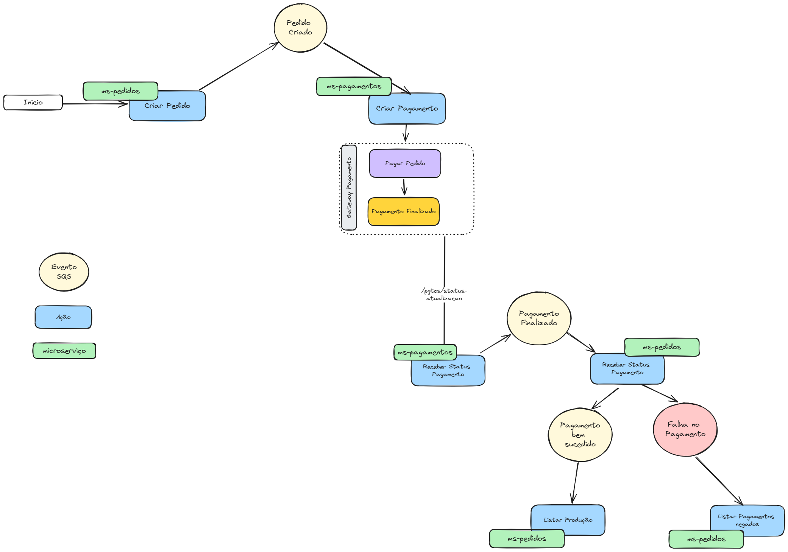
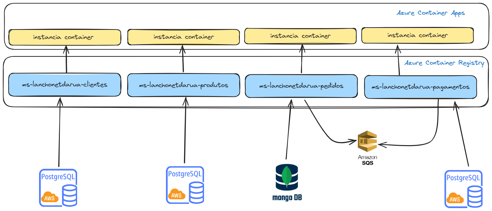

[__TOC__]

# Apresentação
Somos o Grupo 23 da POSTECH de Software Architecture. Vamos apresentar no Tech Challenge da fase 5.

+ Ednei Santos
+ Janduy Araujo
+ Lucas Nishimoto
+ Renan Silva 
+ Tiago Brito

# Objetivos
Incluir padrão saga entre o pagamento do pedido e o envio para a cozinha

+ Justificar os métodos escolhidos;
+ Provisionar uma mensageria

Executar OWASP Zap nos fluxos e gerar relatório de vulnerabilidades

+ Listar/Exibir Cardápio
+ Realizar Pedido
+ Gerar Pagamento
+ Confirmação Pagamento

LGPD

+ Relatório e impacto dos dados pessoais
+ Rota na api cliente para solicitar exclusão de seus dados pessoais

# Github com microservicos e a orquestração

**ms-lanchonetedarua-produtos** - Desenvolvido em python com postgresql
* https://github.com/tbrito/ms-lanchonetedarua-produtos

**ms-lanchonetedarua-clientes*** - Desenvolvido em GO e postgresql
* https://github.com/tbrito/ms-lanchonetedarua-clientes

**ms-lanchonetedarua-pedidos** - Desenvolvido em .NETCore e MongoDB
* https://github.com/tbrito/ms-lanchonetedarua-pedidos

**ms-lanchonetedarua-pagamentos** - Desenvolvido em Groovy e Postresql
* https://github.com/tbrito/ms-lanchonetedarua-pagamento

**lanchonetedarua-docs** - Apresentação da fase 5
* https://github.com/tbrito/lanchonetedarua-docs

# Fluxo da Saga

Passo a Passo:

* Microserviço **[POST] [ms-pedidos]/Pedidos** - Cria um novo pedido com as informações  do cliente, itens do pedido e informações de pagamento

* **Evento <PedidoCriado>** é criado na AWS SQL com informações do pedido;

* Microserviço **[ms-pagamentos]** possui um listener que aguarda mensagens do tipo <Pedido Criado> e Inicia o processo de pagamento junto ao Gateway de Pagamento 

* **[Gateway de Pagamento] aciona um webhook da ms-pagamentos** com informações do processamento pagamento

* Microserviço **[ms-pagamento] Processa a informação do gateway** criando o evento <PagamentoBemSucedido> ou <FalhaNoPagamento>

* Microserviço **[ms-pedidos] Enfilera Pedido**, caso recepcione mensagem de <PagamentoBemSucedido>

* Evento <FalhaNoPagamento> não possui Ação

# Saga Escolhida

Optamos pela Saga Coreografada.

Essa é a estratégia onde a sequência da execução das operações é distribuída entre os participantes da saga.
Trata-se de uma estratégia simples onde os serviços publicam eventos e seus interessados assinam esses eventos e reajam a eles. 

Outro motivo é o baixo acoplamento. os serviços não se comunicam entre si: eles publicam eventos através de um serviço de mensagens, permitindo que cada serviço seja implementado de forma independente. nosso grupo cada um escolheu sua linguagem favorita após definirmos o fluxo de mensagens

# Arquitetura da estrutura da nuvem

* Utilizamos a cloud azure como infraestrutura de containers
* As imagens são “empurradas” para o container Registry via Github Actions
* Utilizamos o Azure Container Apps com orquestrador de instâncias
* Os micro serviços de clientes, produtos e pagamentos utilizam postgres para armazenamento de dados
* Os micro serviços de pedidos e pagamentos coreografam a saga utilizando o serviço de messaging AWS SQS
* O micro serviço de pedidos utiliza o mongodb para armazenamento de dados

# Relatorios de segurança

[RIPD](./RIPD_LanchoneteDaRua.pdf)

[ZAP Repost](./RIPD_LanchoneteDaRua.pdf)

# Demonstração Saga
